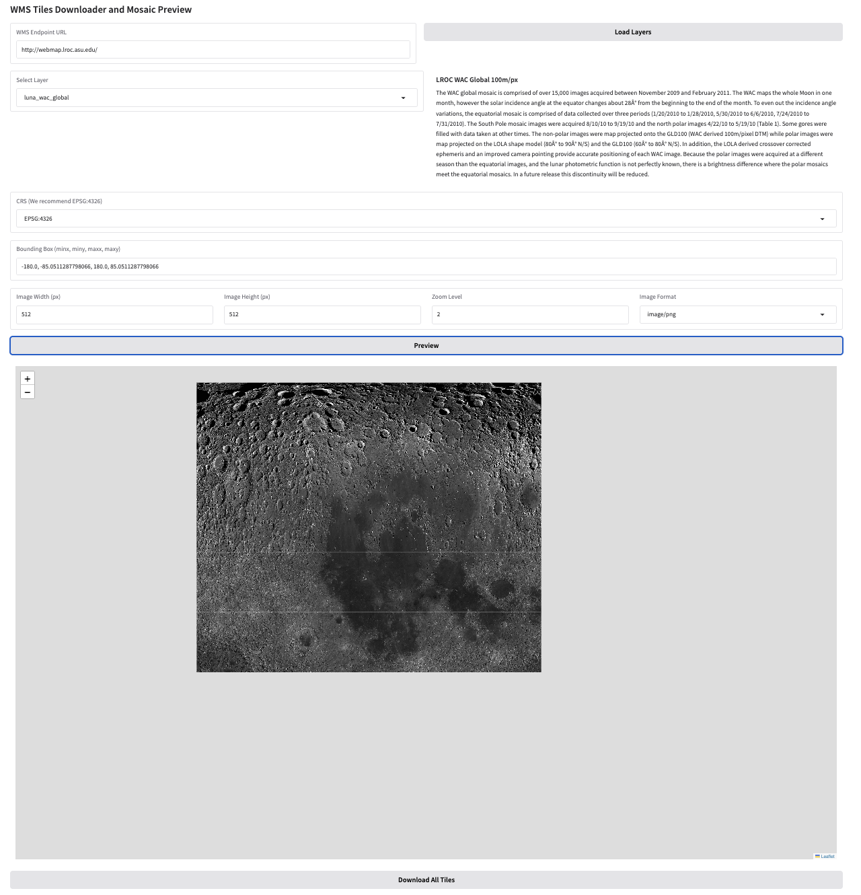

# WMS Scraper Gradio App

A user-friendly web interface for downloading geospatial tiles from WMS endpoints.

## Features

- Connect to any WMS 1.1.1/1.3.0 compliant server
- Preview tiles before full download
- Automatic CRS detection
- Metadata CSV generation
- Mosaic preview with Folium maps

## Installation

1. Clone/Paste the code into `app.py`
2. Install requirements:

```bash
pip install -r requirements.txt
```

## Why was this made?

The reason why this was made is that I couldn't find a good way of scraping wms endpoints.
I needed satelite images of the whole moon when I was working on my Master's thesis which was connected to moon based image retrieval task.


